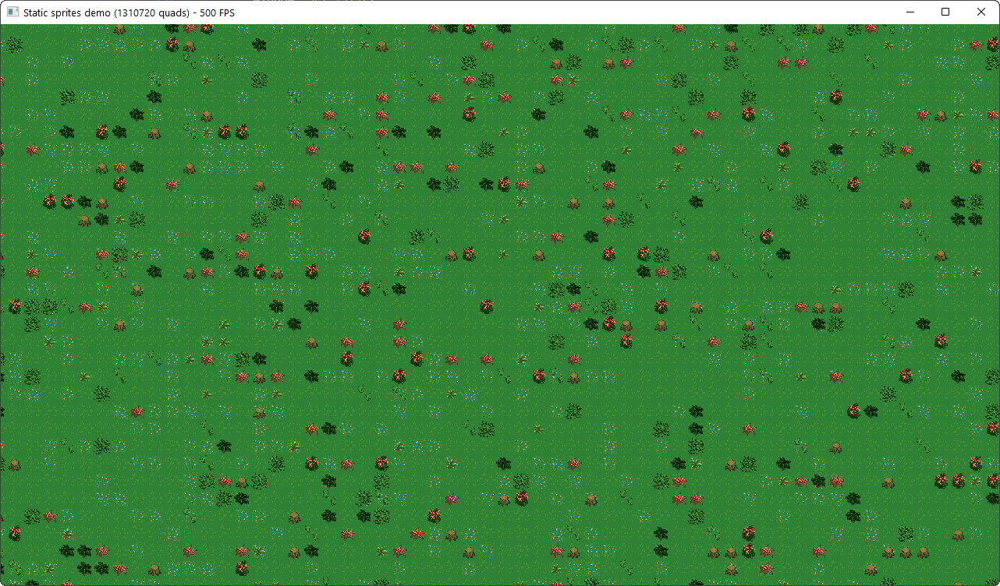

# Static sprite mesh builder for Tetra 2D game framework

This small library helps you create a mesh for drawing lots of small static 2D images.



Imagine creating a 2D game with a large zoomable tile map, something like Factorio.
Usual sprite batches are tailored for dynamic sprites, using them for a large static map will
incur a huge performance hit for no good reason. And frustrum culling won't help in zoomed-out mode.
So ideally you need to create meshes for chunks of your huge map yourself, and this is what this library helps you to do.

## How to use

Take a look at [integration_test.rs](tests/integration_test.rs). As usual, before launching Tetra executables,
make sure SDL2 development libraries are available. 
On Windows, the quickest way is to just drop them at the crate root.
Long story short, here is a tile map example:

```rust
// Use needed packages:
use stabilkon::*;
use tetra::{
    graphics::{
        mesh::{IndexBuffer, Mesh, Vertex, VertexBuffer},
        Color, Rectangle, Texture,
    },
    math::Vec2,
    Context, TetraError,
};
// Load texture atlas with tile images:
let tiles_texture_atlas = Texture::new(ctx, "./tests/resources/forest_tiles.png")?;
// Single tile is 32×32:
let tile_size = 32.0_f32;
// Let's make test map 256×256;
let map_size = Vec2::from(256);
// Calculate required quad limit for the map:
let quad_count = map_size.x * map_size.y;
// Pick grass tile image from atlas; it is located at the very top-left of the texture atlas.
let grass_tile_source = Rectangle::new(0.0, 0.0, 32.0, 32.0);
// When adding a quad to a mesh builder, you can control UV flipping with `UvFlip` parameter.
// By default the usual left-to-right, bottom-to-top system is used.
// But we decided to use left-to-right, top-to-bottom coordinate system in tile source rectangle above, so when
// adding quads using `grass_tile_source` a `UvFlip::Vertical` will be supplied.  

// Create a mesh builder for an indexed mesh capable of holding entire map...
let mut terrain_mesh_builder = MeshBuilder::new(tiles_texture_atlas, quad_count)?;
// ... and add a lot of quads with grass tile texture region:
for y in 0..map_size.y {
    for x in 0..map_size.x {
        let position = Vec2::new(x as f32, y as f32) * tile_size;
        terrain_mesh_builder.push_pos_color_source(position, Color::WHITE, grass_tile_source, UvFlip::Vertical);
    }
}
// Finally, create a mesh consisting of quads covered with grass tile texture region:
let (terrain_mesh, terrain_vb) = terrain_mesh_builder.create_mesh(ctx)?;
// All done, now you can use this mesh as usual!
```

## Update quads in a static mesh after its creation

As you can notice, `create_mesh` returned not just a mesh, but its vertex buffer as well.
In order to change quad vertices, you need to call vertex buffer's `set_data` method
with changed vertices and their offset.


### Change a single quad

```rust
// Assume we have created indexed mesh before, it is `terrain_vb` from the upper example.
let use_indices = true;
// ...and we want to change the eight quad we have added into a hole tile.
let new_quad_index = 7;
let hole_tile_source = Rectangle::new(160.0, 0.0, 32.0, 32.0);
// Calculate its vertex offset:
let offset = new_quad_index * vertices_per_quad(use_indices);
// Get new quad vertices:
let new_quad_params =
    PosColorSource::new(Vec2::new(512.0, 128.0), Color::WHITE, hole_tile_source);
let new_quad_vertices = new_quad_params.to_vertices(texture_size, use_indices);
// Alright, now upload new vertices at the changed offset:
terrain_vb.set_data(ctx, &new_quad_vertices, offset as usize);
```

### Change multiple quads

```rust
// Again, we will be changing `terrain_vb`, but this time we need to have access to entire vertex buffer data.
// Because we are changing random quads, we need to get proper vertices for all quads between the first
// (with the smallest index) and the last (with the biggest index) changed quads. 
// And for that we need to keep `terrain_mesh_builder` around.
// Alright, these are the quads we are going to change into hole tiles:
let changed_quads = [7, 17, 13, 11];
let hole_tile_source = Rectangle::new(160.0, 0.0, 32.0, 32.0);
// Find the first quad and its vertex offset:
let first_changed_quad = changed_quads.iter().min().unwrap();
let first_changed_quad_vertex_offset =
    (first_changed_quad * terrain_mesh_builder.vertices_per_quad()) as usize;
// Find the last quad and its 'end' vertex offset:
let last_changed_quad = changed_quads.iter().max().unwrap();
let last_changed_quad_vertex_offset =
    (last_changed_quad * terrain_mesh_builder.vertices_per_quad()) as usize;
let after_last_changed_quad_vertex_offset =
    last_changed_quad_vertex_offset + terrain_mesh_builder.vertices_per_quad() as usize;
// Perform our changes:
for changed_quad_index in changed_quads {
    terrain_mesh_builder.set_pos_color_source(
        changed_quad_index,
        // Just extrude tiles diagonally from the map for demo purposes:
        Vec2::new(-(changed_quad_index as f32 * 32.0), -(changed_quad_index as f32 * 32.0)),
        Color::WHITE,
        hole_tile_source,
        UvFlip::Vertical,
    );
}
// Upload our changes to terrain vertex buffer:
let vertices_to_upload = &terrain_mesh_builder.vertices()
    [first_changed_quad_vertex_offset..after_last_changed_quad_vertex_offset];
terrain_vb.set_data(ctx, vertices_to_upload, first_changed_quad_vertex_offset);
```


## Limitations

There are 2 things you might want to keep in mind:

1. There is 1 texture per mesh, so all your images should be packed into a texture atlas.
If a single atlas is not enough, create several meshes and overlay them.
2. Mesh itself should not be too big, so keep your map chunks reasonable, like 1 048 576 quads (1024×1024).

>OpenGL does not specify max size for buffers, leaving implementation details to the GPU driver.
As of 2021, high-end GPUs can be expected to allocate 512 MB for a single vertex buffer,
but certain Intel chipsets may fail to allocate anything over 32 MB though.